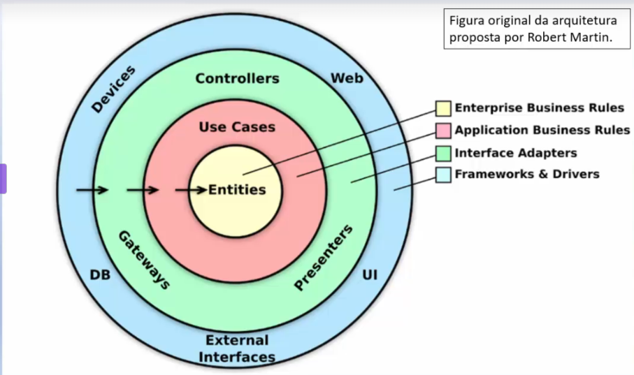
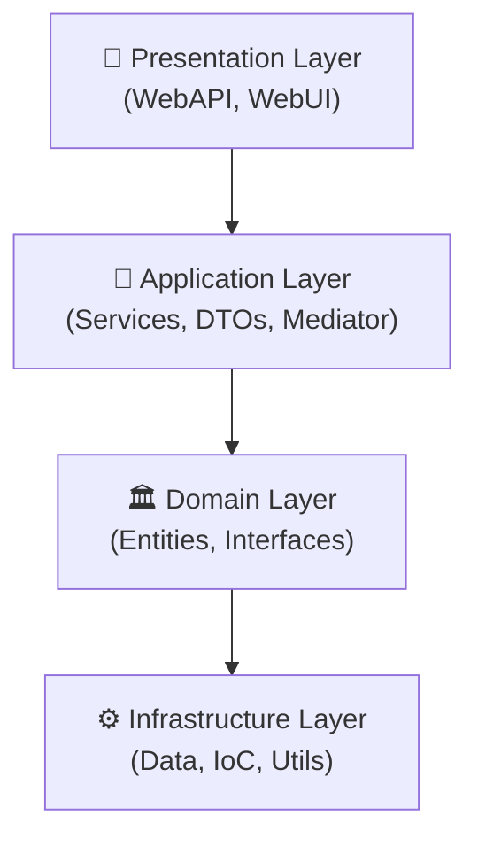

# clean-arch-products
Exploring clean arch pattern using .net core! The project have only two entities: Category and Product.

<P> There are a MVC Project and a WebAPI also.</p>

<p>It was built just to remember some concepts and implementations of the pattern using .Net Core. And also other concepts and patterns, like: </p>

 - Logging with Datadog
 - Messaging with Kafka and SQS
 - Mediator
 - Repository Pattern

<p></p>


# About the Clean Arch pattern



<p>The depencies should be from outside to inside, which means, for example: The Product


# CleanArch-Products

A comprehensive .NET Core project demonstrating Clean Architecture principles with Category and Product entities. The project includes both a MVC WebUI and a WebAPI for exploring different architectural patterns and best practices.

## 🏗️ Architecture Overview

This project adheres to Clean Architecture principles, maintaining dependency inversion: outer layers depend on inner layers, never the reverse:




## 📁 Project Structure

- **CleanArch-Products.Domain** - Core business logic and entities
  - Entities: `Category`, `Product`, `EntityBase`
  - Domain Validation
  - Repository Interfaces

- **CleanArch-Products.Application** - Application services and DTOs
  - Services: `CategoryService`, `ProductService`
  - Data Transfer Objects for each entity
  - Mediator pattern implementation
  - AutoMapper profiles for domain-to-DTO mapping

- **CleanArch-Products.WebAPI** - RESTful API layer
  - API Controllers
  - HTTP endpoints

- **CleanArch-Products.WebUI** - MVC presentation layer
  - Controllers
  - Views
  - Static assets

- **CleanArch-Products.Infra.IoC** - Dependency Injection configuration

- **CleanArch-Products.Infra.Utils** - Utilities and middleware
  - Messaging infrastructure
  - Custom middleware

- **CleanArch-Products.Domain.Tests** - Unit tests for domain logic

## 🔑 Key Patterns & Technologies

- **Clean Architecture** - Separation of concerns across layers
- **Repository Pattern** - Abstract data access layer
- **Mediator Pattern** - Decoupled request/response handling
- **Dependency Injection** - Built-in .NET Core DI container
- **AutoMapper** - Object-to-object mapping
- **Logging** - Datadog integration
- **Messaging** - Kafka and AWS SQS support
- **Unit Testing** - XUnit test framework

## 🚀 Getting Started

### Prerequisites
- .NET Core SDK 9+
- Visual Studio 2022 or VS Code
- SQL Server 
- Docker (for Kafka, SQS and Datadog) 
- Datadog API Key  (optional, but if used should have a key) *DataDog's site provides free trial keys*

### Installation

1. Clone the repository
```bash
git clone <repository-url>
cd clean-arch
```

2. Restore dependencies
```cmd
dotnet restore
```
3. Build the solution
```cmd
dotnet build
```

4. Set up the Database
Ensure you have **SQL Server or SQL Server Express** installed on your machine. Then run the Entity Framework migrations:
```cmd
dotnet ef database update --project CleanArch-Products.Infra.Data
```

5. Set up Containers (Kafka and LocalStack for SQS)
The project uses Docker containers for messaging infrastructure. Navigate to the `infra` folder and start the services:
```bash
cd infra
docker-compose -f docker/kafka/docker-compose.yml up -d
docker-compose -f docker/aws/sqs/docker-compose.yml up -d
```

This will start:
- **Kafka** - For message queuing
- **LocalStack** - For local AWS SQS simulation

For more details on the Docker setup, see the configuration files in the `infra/docker` directory. 


6. Running the Application

```shell
dotnet run --project CleanArch-Products.WebAPI
```
<p>WebAPI API will be available at https://localhost:5041 </p>

```shell
dotnet run --project CleanArch-Products.WebUI
```
<p>WebUI (MVC) will be available at https://localhost:5284 </p>

### 📚 API Endpoints

 - GET /api/categories
 - POST /api/categories 
 - GET /api/products 
 - POST /api/products 

 > view more at https://localhost:5041/swagger

### 🔧 Configuration
Update appsettings.json and appsettings.Development.json in the WebAPI and WebUI projects for:

Database connections
Datadog logging credentials
Kafka/SQS messaging settings

### 🧪 Running Tests
```bash
dotnet test CleanArch-Products.Domain.Tests
```

### 📝 License
This project is for learning and educational purposes.

### 🤝 Contributing
Contributions are welcome! Feel free to submit issues or pull requests.